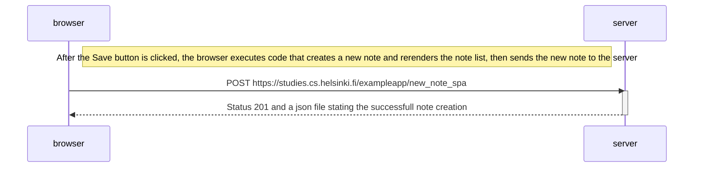

```mermaid
sequenceDiagram
    participant browser
    participant server

    Note right of browser: After the Save button is clicked, the browser executes code that creates a new note and rerenders the note list, then sends the new note to the server
    browser->>server: POST https://studies.cs.helsinki.fi/exampleapp/new_note_spa
    activate server
    server-->>browser: Status 201 and a json file stating the successfull note creation
    deactivate server
```